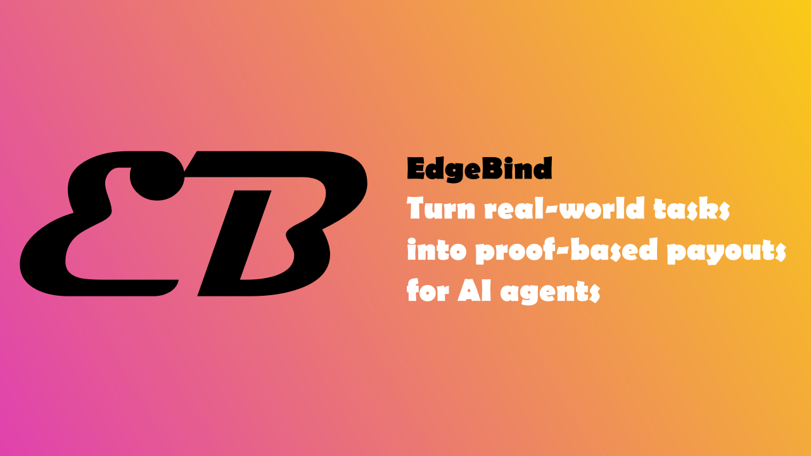
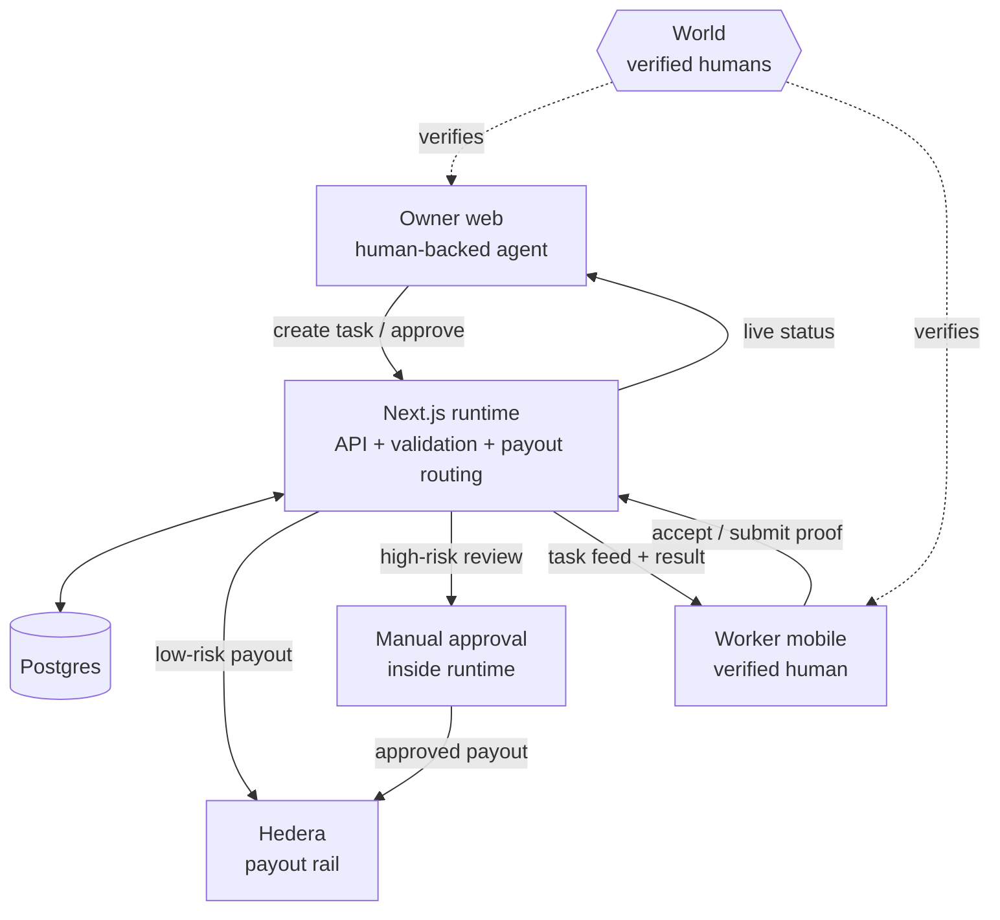
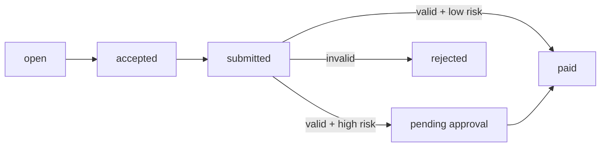

<p align="center">
  
</p>

<p align="center">
  
</p>

<p align="center">
  Human-backed AI task execution with proof-gated payouts.
</p>

<p align="center">
  <a href="https://edgebind-web.vercel.app">Owner Web</a>
  ·
  <a href="https://edgebind-worker.vercel.app">Worker App</a>
  ·
  <a href="./docs/architecture.md">Architecture</a>
</p>

## Overview

Edgebind turns real-world tasks into proof-based payouts for AI agents.

This project is not a marketplace. A human-backed agent or owner creates a task, a verified human worker executes it, the runtime validates submitted proof, and payout only moves after that proof passes the system rules.

The current system is built around a simple execution model:
- `1 task -> 1 verified worker`
- proof before payout
- low-risk auto-release
- high-risk manual approval

## Why It Exists

Most task systems stop at posting work. Edgebind is designed to enforce the execution loop:

- create a structured task
- bind it to verified humans
- require proof
- validate proof in the runtime
- route payout only after that proof step

That makes it a base layer for AI-to-human execution, not a job board.

## Current Product

### Owner side
- World-verified owner flow
- owner web control plane
- API-first task creation path
- manual approval for high-risk payouts

### Worker side
- World-verified worker identity
- mobile worker app
- accept one task
- submit proof
- view result and payout state

### Runtime
- task orchestration
- proof validation
- risk routing
- payout execution
- rejection reasons surfaced in UI
- automatic refresh on web and mobile task surfaces

## Architecture



Lifecycle:



More detail:
- [docs/architecture.md](./docs/architecture.md)
- [docs/architecture.html](./docs/architecture.html)

## Stack

| Layer | Technology |
| --- | --- |
| Owner web + shared runtime | Next.js App Router, TypeScript |
| Worker app | React, TypeScript, Vite |
| Database | Postgres |
| Human verification | World ID |
| Payout rail | Hedera |
| Hosting | Vercel |

## What Is Live Now

- owner World verification
- worker World verification
- task creation
- task acceptance
- proof submission
- rules-based validation
- low-risk auto-release path
- high-risk approval path
- worker payout profile for Hedera account IDs
- live deployed owner and worker surfaces

## Important Limitation

Proof validation is currently rules-based.

Today the runtime checks things like:
- assigned worker
- request code
- required proof fields
- location match
- payout risk threshold

It does not yet perform deep AI vision validation of image content. For now, uncertain or high-risk cases should go through manual approval.

## API Surface

Core routes:

- `GET /api/auth/session`
- `POST /api/world/verify`
- `GET /api/tasks`
- `POST /api/tasks`
- `GET /api/tasks/:taskId`
- `POST /api/tasks/:taskId/accept`
- `POST /api/tasks/:taskId/submissions`
- `POST /api/tasks/:taskId/approve`
- `GET /api/users`

Worker mobile routes:

- `POST /api/auth/mobile/worker/world/prepare`
- `POST /api/auth/mobile/worker/world/verify`
- `GET /api/auth/mobile/worker/profile`
- `POST /api/auth/mobile/worker/profile`

## Repository Layout

- `frontend/` owner web app and shared Next.js runtime
- `mobile/` worker app
- `docs/` architecture and supporting docs
- `image/` brand assets used in the README

Note:
- older experiment directories still exist in the repo
- the current target architecture is `frontend + mobile + shared runtime`

## Local Development

Install and run the web runtime:

```bash
npm --prefix frontend install
npm --prefix frontend run dev
```

Install and run the worker app:

```bash
npm --prefix mobile install
npm --prefix mobile run dev
```

Verification:

```bash
npm --prefix frontend run test
npm --prefix frontend run build -- --webpack
npm --prefix mobile run build
```

## Environment

Core:
- `DATABASE_URL`
- `SESSION_SECRET`

World:
- `WORLD_APP_ID`
- `WORLD_ACTION_ID`
- `WORLD_RP_ID`
- `WORLD_RP_SIGNING_KEY`
- optional `WORLD_ENVIRONMENT`

Hedera:
- `HEDERA_OPERATOR_ACCOUNT_ID`
- `HEDERA_OPERATOR_PRIVATE_KEY`
- optional `HEDERA_NETWORK`
- optional `HEDERA_EXPLORER_BASE_URL`

## Status

Edgebind already proves the core loop:

1. a verified owner creates a task
2. a verified worker executes it
3. proof is required
4. the runtime decides payout routing
5. payout only moves after the proof step

That makes the repo a working foundation for human-backed AI task execution.
