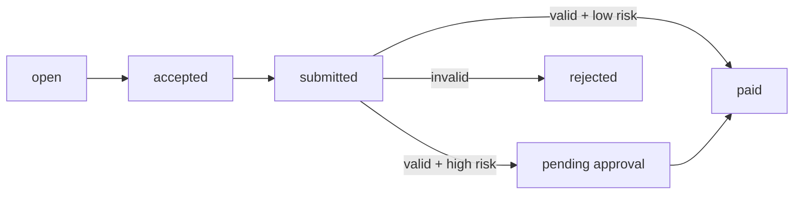

<p align="center">
  
</p>

<p align="center">
  
</p>

<h1 align="center">Edgebind Oracle</h1>

<p align="center">Human-backed AI task execution with proof-gated payouts.</p>

Edgebind turns real-world tasks into proof-based payouts for AI agents.

It is not a marketplace. An owner or human-backed agent creates a task, a verified human worker executes it, the runtime validates submitted proof, and payout only moves after that proof passes the system rules.

Live:
- owner web + shared runtime: `https://edgebind-web.vercel.app`
- worker app: `https://edgebind-worker.vercel.app`

## What It Does

- owner creates a task in the web control plane or through the API
- verified human worker accepts exactly one task
- worker submits proof
- backend validates the submission
- low-risk payouts auto-release
- high-risk payouts wait for manual approval
- Hedera is the payout rail
- World is the human verification layer
- Ledger is the manual approval layer for high-risk payouts only

## Current Product Shape

- `1 task -> 1 worker`
- no marketplace bidding
- no multi-worker slots
- no separate backend service
- owner web and backend share one Next.js runtime
- mobile talks to that same runtime over API

## Stack

- web/runtime: Next.js App Router + TypeScript
- mobile: React + TypeScript + Vite
- database: Postgres
- identity: World ID
- payout rail: Hedera
- deploy: Vercel

## Architecture

Current target architecture:


Lifecycle:



Visual graph:
- [docs/architecture.html](./docs/architecture.html)

## Workflow

1. owner verifies with World
2. owner creates task
3. task is stored in Postgres
4. worker verifies with World in the mobile app
5. worker accepts one open task
6. worker submits proof
7. runtime validates the submission
8. payout auto-releases or moves to approval
9. result appears in both owner and worker surfaces

## What Is Live Now

- owner World verification
- worker World verification
- owner task creation
- worker task acceptance
- proof submission
- rules-based validation
- rejection reasons visible in UI
- high-risk manual approval flow
- Hedera payout integration in the runtime
- worker Hedera payout account profile
- automatic live refresh on web and mobile task surfaces

## Important Current Limitation

Proof validation is currently rules-based.

Today the runtime checks things like:
- assigned worker
- request code
- required fields
- location match
- payout risk threshold

It does not yet do deep AI vision validation of image content. For now, high-risk or uncertain cases should go through manual approval.

## API

Main routes:

- `GET /api/auth/session`
- `POST /api/world/verify`
- `GET /api/tasks`
- `POST /api/tasks`
- `GET /api/tasks/:taskId`
- `POST /api/tasks/:taskId/accept`
- `POST /api/tasks/:taskId/submissions`
- `POST /api/tasks/:taskId/approve`
- `GET /api/users`

The worker mobile app uses the same runtime through:

- `POST /api/auth/mobile/worker/world/prepare`
- `POST /api/auth/mobile/worker/world/verify`
- `GET /api/auth/mobile/worker/profile`
- `POST /api/auth/mobile/worker/profile`

## Project Layout

Current active path:

- `frontend/` owner web app + shared Next.js runtime
- `mobile/` worker app
- `docs/` architecture and project docs

Repo note:
- older experiment directories still exist in the repo, but the current target architecture is `frontend + mobile + shared runtime`

## Local Development

Web runtime:

```bash
npm --prefix frontend install
npm --prefix frontend run dev
```

Worker app:

```bash
npm --prefix mobile install
npm --prefix mobile run dev
```

Tests:

```bash
npm --prefix frontend run test
npm --prefix frontend run build -- --webpack
npm --prefix mobile run build
```

## Environment

Core runtime:

- `DATABASE_URL`
- `SESSION_SECRET`

World:

- `WORLD_APP_ID`
- `WORLD_ACTION_ID`
- `WORLD_RP_ID`
- `WORLD_RP_SIGNING_KEY`
- optional `WORLD_ENVIRONMENT`

Hedera:

- `HEDERA_OPERATOR_ACCOUNT_ID`
- `HEDERA_OPERATOR_PRIVATE_KEY`
- optional `HEDERA_NETWORK`
- optional `HEDERA_EXPLORER_BASE_URL`

## Status

This repo already proves the core product loop:

- verified owner creates task
- verified worker executes task
- proof gates payout
- low-risk can auto-release
- high-risk can require approval

That makes Edgebind a working base for human-backed AI task execution, not a task marketplace.
