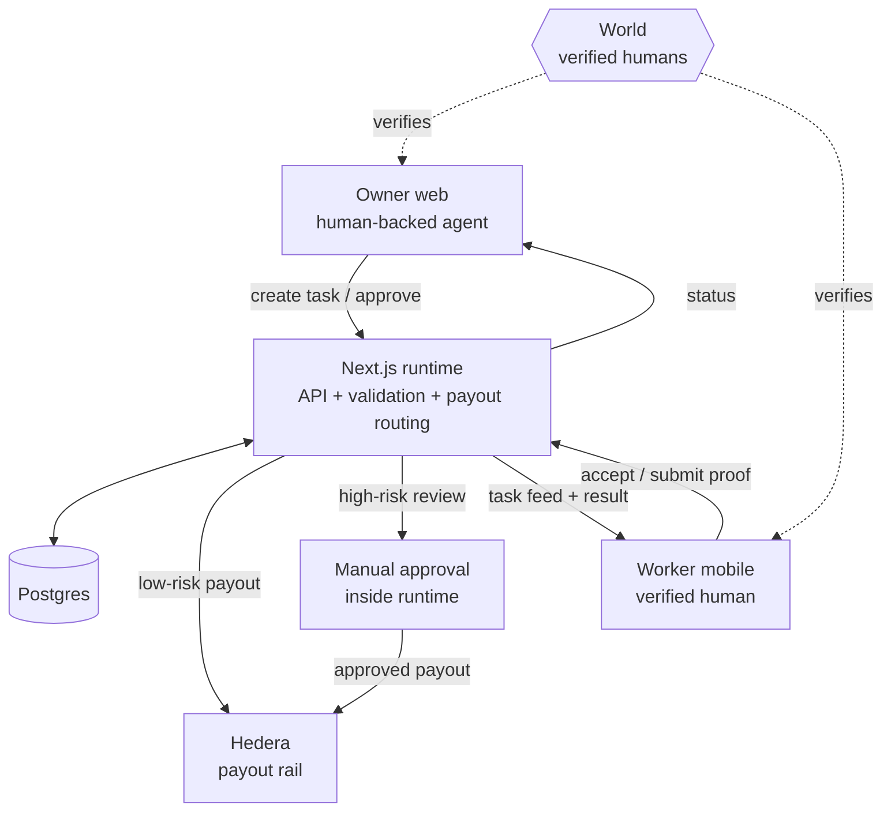
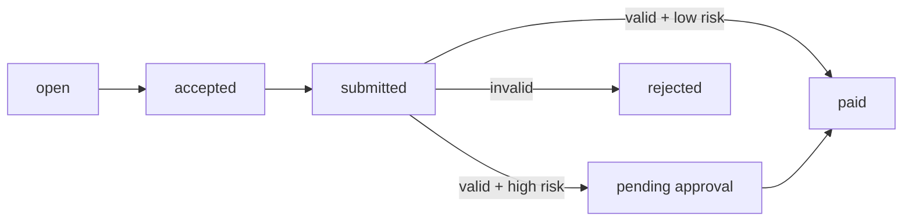

# Architecture

Open `docs/architecture.html` for the visual graph.

## System

## Lifecycle

## Notes

- `frontend` = owner web app + shared Next.js runtime
- `mobile` = worker app
- `1 task -> 1 worker`
- no separate backend app
- World = human verification
- Hedera = payout rail
- manual approval lives inside the runtime today
- proof validation is currently rules-based
