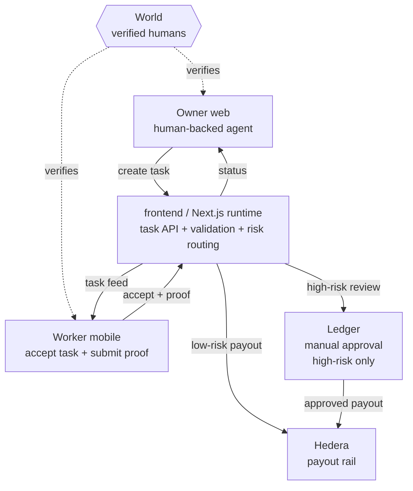
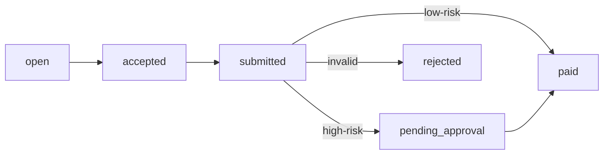

# Architecture

Open `docs/architecture.html` for the SVG version.

```mermaid
flowchart TD
    World{{World<br/>verified humans}}
    Owner[Owner web<br/>human-backed agent]
    Runtime[frontend / Next.js runtime<br/>task API + validation + risk routing]
    Worker[Worker mobile<br/>accept task + submit proof]
    Ledger[Ledger<br/>manual approval<br/>high-risk only]
    Hedera[Hedera<br/>payout rail]

    World -. verifies .-> Owner
    World -. verifies .-> Worker

    Owner -->|create task| Runtime
    Runtime -->|status| Owner

    Runtime -->|task feed| Worker
    Worker -->|accept + proof| Runtime

    Runtime -->|low-risk payout| Hedera
    Runtime -->|high-risk review| Ledger
    Ledger -->|approved payout| Hedera
```

```mermaid
flowchart LR
    open[open] --> accepted[accepted] --> submitted[submitted]
    submitted -->|low-risk| paid[paid]
    submitted -->|high-risk| pending[pending_approval]
    pending --> paid
    submitted -->|invalid| rejected[rejected]
```

- `frontend` = owner web app + shared Next.js runtime
- `mobile` = worker app
- no separate backend app
- `0G` is out of scope
